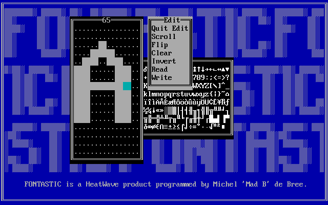

# Fontastic (1992)

An MS-DOS font editor, found on an old CD-ROM.



The binaries are provided in the `target` folder. You probably need
[DOSBox](https://www.dosbox.com/) to run them.

The original `Fontasti.doc`:

```
FONTASTIC
---------

FONTASTIC helps you to change or design fonts (character-sets) and use them
          for your own purposes.

FONTASTIC was made by Michel 'Mad B' de Bree of HeatWave Digital Designs.

The complete FONTASTIC contains:

 FONTASTI.DOC (this file)
 FONTASTI.EXE (the font-editor)
 FNT2COM.EXE  (to make an executable file which installs the font)
 FNT2FNT.EXE  (to convert fonts
 OUTLINE.EXE  (to outline a font)

FONTASTIC requires:

-An IBM compatible PC with...
-MS DOS or compatible,
-A (not too old) keyboard,
-An Enhanced Graphics Adaptor (EGA) or Video Graphics Array (VGA) with
 supporting monitor.
-Enough memory to load FONTASTIC of course...

This is what you do if you need help:

-Start FONTASTIC with FONTASTI.EXE
-Select your video-mode: Place the bar by pressing the up/down arrows and
 enter
-Press ESC
-Select Help in the menu: Place the bar over 'Help' by pressing the up/down
 arrows and enter. The built-in help takes over from here...

N.B. If you select VGA in EGA mode or vice versa, FONTASTIC will probably not
     function well! Select VGA only when in VGA mode. Select EGA only when
     in EGA mode.
     If you try to load a font that is not the proper height (14 for EGA, 16
     for VGA), it will be ignored without further messages.

Technical info : The format of a FONTASTIC .FNT-file is very simple:
                 -the first byte is the font height.
                 -rest is font data, starting with char 0 byte 0 etc.
                  until char 255...
                 So the file length is 1+height*256 bytes.


FNT2COM
-------
If you want to install a FONTASTIC-font, make a COM-file out of the FNT-file
by using FNT2COM. The COM-file can be started like any other COM-file and
installs the character-set immediately. The COM-file is the ONLY thing you
need to use the font. It will be just a little longer then the original
FNT-file. To make a COM-file out of a FNT-file type:

FNT2COM fontname

fontname is the name of the font WITHOUT extension.

The original FNT-file will remain on the disk.
If you installed a font and you want to change back to the standard font,
I suggest you make a COM-file of the standard font aswell.

N.B. These fonts are textscreen-fonts and won't work in graphics mode.
     If you switch to a heigher font, the cursor might get out of the screen.
     If you switch to a smaller font, old screen-data might become visible.
     It is therefore recommended that you clear the screen after switching
     fonts.


FNT2FNT
-------

FONTASTIC can only work with fonts of height 14 (EGA) and 16 (VGA).
Because you might want to convert fonts of other heights to one with which
FONTASTIC can work, or want to convert FONTASTIC-fonts to another size, there
is FNT2FNT. Use it like this:

FNT2FNT fontname newfontname

fontname is the name of the font to convert WITHOUT extension.
newfontname is the name for the new font which is created on the disk.

There are two different types of converting:

1) The new font is smaller than the font to convert.
   This will delete some lines from each char. You are asked for the numbers
   of the lines to delete.

2) The new font is larger than the font to convert.
   This will add some blank line at the bottom of each char.


OUTLINE
-------

This will 'outline' a font. Try it and watch the result. To outline a font:

OUTLINE fontname newfontname

fontname is the name of the font to outline WITHOUT extension.
newfontname is the name of the new font (the outlined one) WITHOUT extension.


HeatWave Digital Designs are:
-----------------------------
Michel 'Mad B' de Bree     :                              Programmer, Musician
Bas 'Bas' Broers           :                                        Programmer
Marvin 'Trooper' Severijns :                  Musician, Graphician, Programmer
Dennis 'Dandy' Middelkoop  :                                  Graphician, P.R.
```
